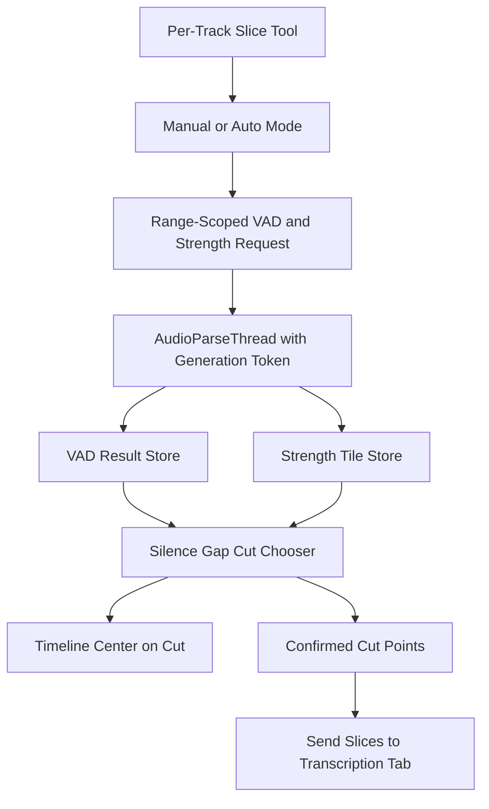

# VAD Auto-Slicer Implementation Plan

## Scope
Build the feature described in [src/gui/vad_exp/todo.md](src/gui/vad_exp/todo.md): each VAD track gets its own `Slice Tool` panel, manual and auto slice modes drive range-scoped VAD/strength requests, and slices are only sent to the transcription tab after explicit user approval.

Primary files:
- [src/gui/vad_exp_tab.py](src/gui/vad_exp_tab.py) for tab-level analysis orchestration and approval gate behavior.
- [src/gui/vad_exp/timeline_widgets.py](src/gui/vad_exp/timeline_widgets.py) for per-track Slice Tool UI, manual cuts, and send-slices wiring.
- [src/gui/vad_exp/timeline_controller.py](src/gui/vad_exp/timeline_controller.py) for centering the viewport on generated cut points.
- [src/gui/flying_message.py](src/gui/flying_message.py) for reusable countdown flyer messages.
- [src/vad/service.py](src/vad/service.py), [src/vad/models.py](src/vad/models.py), and [src/gui/vad_exp/audio_parse_thread.py](src/gui/vad_exp/audio_parse_thread.py) for range-scoped strength/VAD outputs.
- [config.example.yaml](config.example.yaml) for clarifying existing parallel VAD config is not auto-slicer config.

## Architecture

## Implementation Steps
1. Normalize the plan assumptions in code comments and config docs.
- Add a comment near `tasks.vad.slice_minutes` in [config.example.yaml](config.example.yaml): this config controls parallel VAD chunking, not auto-slicer slice length.
- Keep auto-slicer settings separate from `ConfigManager.get_vad_config()`.

2. Add range-scoped strength output support.
- Extend VAD analysis outputs in [src/vad/models.py](src/vad/models.py) so a range request can return an `AudioStrengthPatch`, not just a full-length `amplitude_series`.
- Update [src/vad/service.py](src/vad/service.py) so amplitude-only range requests use `extract_audio_strength_range_series()` instead of extracting the full media.
- Update [src/gui/vad_exp/audio_parse_thread.py](src/gui/vad_exp/audio_parse_thread.py) and [src/gui/vad_exp_tab.py](src/gui/vad_exp_tab.py) so partial/range results patch `AudioStrengthTileStore` without clearing prior processed ranges.

3. Fix long-media approval gate behavior.
- For media longer than `APPROVAL_THRESHOLD_SEC`, auto-start only the first `min(180, duration)` seconds of strength preview.
- Keep the existing `Approve` button available for full or user-triggered analysis.
- Prevent approval-triggered full analysis from racing with an active auto/manual slice analysis request.

4. Add reusable countdown flyer support.
- Extend [src/gui/flying_message.py](src/gui/flying_message.py) with a countdown helper using the existing `FlyingLabel` style.
- Countdown should update once per second, stay non-modal, not intercept timeline interaction, and support a completion callback guarded by a generation/token.

5. Add timeline navigation helper.
- Add `center_on_time(time_sec)` to [src/gui/vad_exp/timeline_controller.py](src/gui/vad_exp/timeline_controller.py).
- Use it after countdown expiry or analysis completion, but only for the latest active generation/token.

6. Replace per-row blade/send buttons with per-row Slice Tool entry.
- In [src/gui/vad_exp/timeline_widgets.py](src/gui/vad_exp/timeline_widgets.py), replace the existing scissor + `Send Slices` button row with a `Slice Tool` button per `VadMethodRow`.
- The popup/panel belongs to that row/track. There will be three panels logically, one for each current VAD track.
- Avoid fixed tiny button widths; use minimum widths and normal size policies so button text remains readable.

7. Implement Slice Tool panel behavior.
- Add slice length buttons: `~10min`, `<3min`, `<1min`, `<30s` as mutually exclusive buttons.
- Add hover notebar text via event filters or lightweight custom buttons.
- Add `Manual Slice`, `Auto Slice`, and `Send slices to transcribe tab` controls.
- Disable controls according to mode: manual disables auto/send; active auto disables manual/send/time buttons but remains clickable to stop.

8. Implement cut selection logic.
- Create a focused helper for finding silence gaps around target time.
- Preserve the intended long-gap formula from the todo: `max((a+b)/2, b-3s)`, so long silence is biased toward the right edge and the next slice reaches speech sooner.
- Candidate ranking should prefer proximity to target, then longer silence duration; add a docstring explaining this ranking.
- Use strength-lowest fallback, then target fallback when no valid silence gap exists.

9. Wire auto slicing.
- Auto mode starts from the latest confirmed cut, requests the next probe window, computes a cut, inserts it, centers the timeline, then repeats until stop/end/error.
- Only one analysis thread should run per tab at a time. Use `parse_generation` or a dedicated slicer generation to ignore stale callbacks.
- Stop safely by cancelling the current thread and re-enabling disabled controls.

10. Wire manual slicing.
- Manual mode still uses click to add and `Shift+click` to delete cuts.
- After creating a cut, start the 3-second countdown and trigger the next-region VAD/strength request based on that newly selected cut.
- Deleting a cut performs no automatic request or jump.

11. Add GUI preference persistence.
- Add a small storage helper for `./gui-state/vad-slicer/preferences.yaml`.
- Persist only the active slice length preset in the first pass.
- Use a structure that can later support asymmetric lookaround, for example `before_seconds` and `after_seconds` per preset.

12. Test and verify.
- Add focused tests for the cut selection helper, including long silence bias, no-gap fallback, and hard-limit behavior.
- Add or update service/thread tests for range-scoped amplitude patches.
- Run the relevant unit tests and a linter check on edited files.

## Risks
- Current VAD rows include placeholder methods. Auto slicing should either be disabled for placeholders or routed only when a real engine exists.
- Existing processed-range UI state is not cumulative across requests; this must be fixed before auto/manual repeated probing will display correctly.
- Full approval analysis and Slice Tool probing share `parse_thread`, so concurrency must be explicitly guarded.