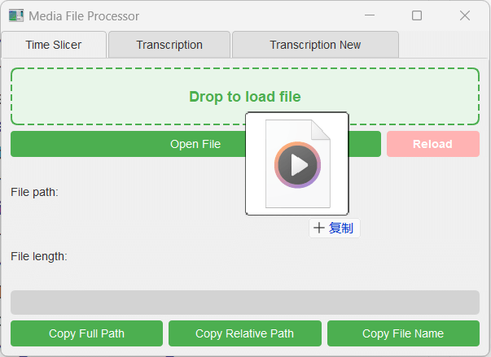
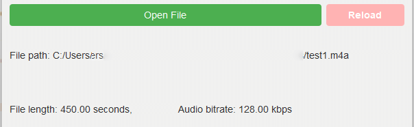
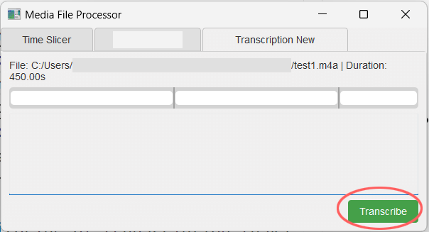
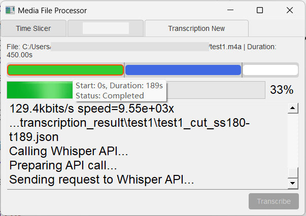

# OpenAI-Whisper based Media Transcription Tool

This project, including this readme, is generated by Cursor AI and Claude Sonnet 3.5.

A desktop application for transcribing audio/video files using OpenAI's Whisper API.  
The tool provides a graphical interface for slicing media files and managing transcription tasks.

## Features

- **Drag & Drop Interface**: Easy file loading through drag and drop or file browser

- **Media File Analysis**: Automatic detection of file duration and audio properties

- **Time Slicing**: Visual interface for viewing and managing media segments

- **Transcription**: Integration with OpenAI's Whisper API for accurate audio transcription

- **Progress Tracking**: Real-time progress monitoring of transcription tasks

- **Multi-format Support**: Handles various media formats (mp3, mp4, m4a, etc.)

## Prerequisites

- Python 3.x
- PyQt5
- FFmpeg
- OpenAI API key

## Installation

1. Clone the repository
2. Install dependencies:
    ```bash
    pip install PyQt5
    ```
3. Set up configuration:
   - Copy `api_key_archive-example` to `api_key_archive` and add your OpenAI API key
   - Copy `api_endpoint-example` to `api_endpoint` and verify the endpoint URL

## Configuration Files

- `api_key_archive`: Store your OpenAI API key
- `api_endpoint`: OpenAI API endpoint URL (default: https://api.openai.com)

## Usage

1. Run the application:
    ```bash
    python start.py
    ```


2. Use the interface to:
   - Load media files via drag & drop or file browser
   - View file information and segments
   - Start transcription tasks
   - Monitor progress
   - View transcription results

## Project Structure

- `src/`
  - `gui/`: GUI components and interface logic
  - `transcriber_core/`: Core transcription functionality
  - `time_slicer/`: Media file slicing utilities
  - `hear_result_merger/`: Transcription result processing
- `transcription_result/`: Output directory for transcriptions
- `tmp_audio_segments/`: Temporary storage for audio processing

## Notes

- Maximum file size for transcription: 25MB each segment per OpenAI's API limitation
- Recommended audio segment length: ~10 minutes at 128Kbps audio track for optimal results, segment duration varies for other bitrates